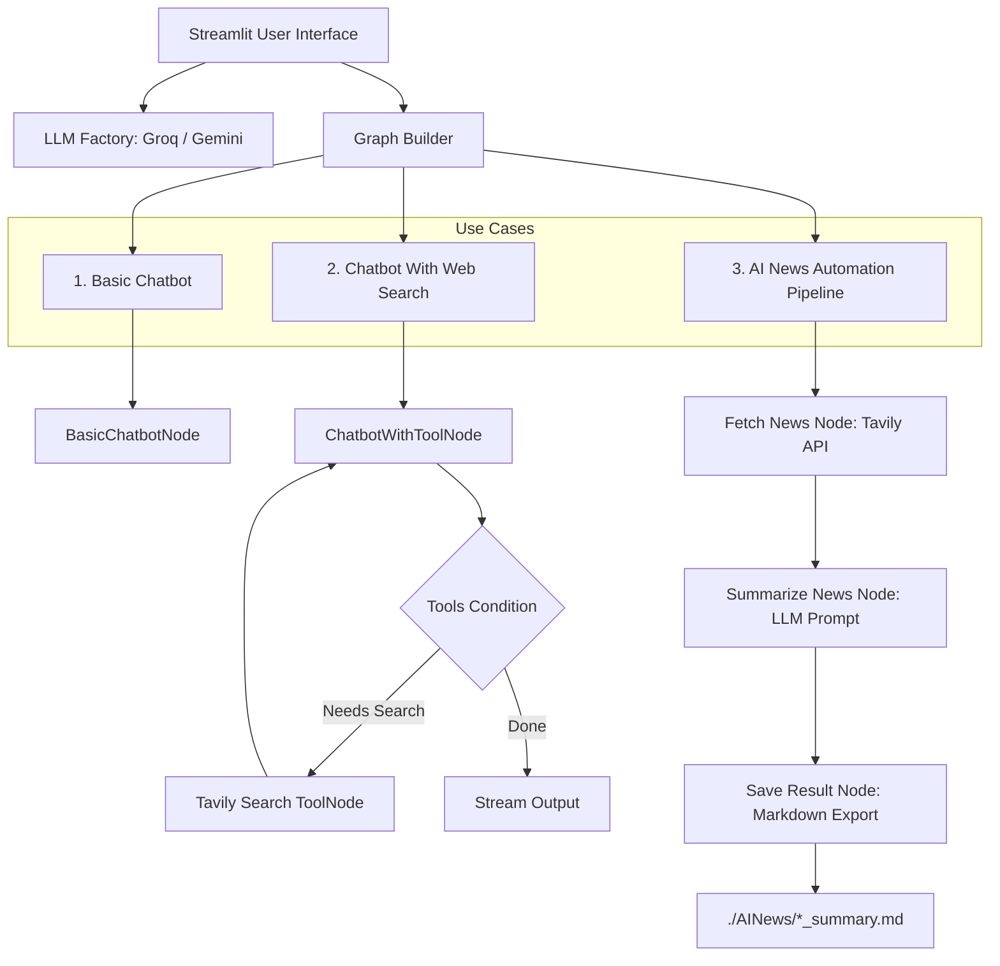

# 🤖 Agentic AI Chatbot with LangGraph, Groq & Streamlit


An **End-to-End Stateful Agentic AI Application** built using **LangGraph**, **LangChain**, **Groq/Gemini LLMs**, **Tavily Web Search**, and **Streamlit**. 

This project demonstrates modular, production-ready agentic architectures—ranging from single-node stateful chat agents to multi-node autonomous tool-calling graphs and automated data scraping/summarization pipelines.

---

## 🌟 Key Features

* 💬 **Stateful Conversational AI**: Retains conversation state across user interactions using LangGraph's `StateGraph` and message reducers.
* 🌐 **Autonomous Web Search Agent**: Dynamic tool routing via Tavily Search API to answer real-time questions with up-to-date web information.
* 📰 **Automated AI News Pipeline**: Autonomous multi-step graph workflow (`Fetch -> Summarize -> Export`) that scrapes news (daily/weekly/monthly), generates markdown summaries formatted with IST dates & citations, and exports report files.
* 🎛️ **Modular LLM Integration**: Easily toggle between **Groq** (`llama-3.3-70b-versatile`, `openai/gpt-oss-120b`) and **Google Gemini** (`gemini-2.5-flash`, `gemini-2.5-pro`).
* 🎨 **Interactive Streamlit UI**: Clean sidebar control panel for model selection, API key configuration, and real-time output rendering.
* 🏗️ **Clean Architectural Abstraction**: Decoupled layers for LLM factories, Graph builders, Nodes, State management, Tools, and UI.

---

## 🏗️ System Architecture



---

## 📁 Repository Structure

```
AGENTICCHATBOT/
├── app.py                             # Main Streamlit application launcher
├── requirements.txt                   # Project dependencies
├── README.md                          # Project documentation
├── AINews/                            # Output directory for generated markdown reports
│   ├── daily_summary.md
│   ├── weekly_summary.md
│   └── monthly_summary.md
└── src/
    └── langgraphagenticai/
        ├── main.py                    # Application lifecycle coordinator
        ├── LLMS/                      # LLM Provider abstractions
        │   ├── groqllm.py             # Groq API client handler
        │   └── geminillm.py           # Google Gemini API client handler
        ├── graph/                     # LangGraph graph builder & compilers
        │   └── graph_builder.py       # Graph definitions for all 3 use cases
        ├── nodes/                     # Custom node definitions
        │   ├── basic_chatbot_node.py  # Basic LLM invocation node
        │   ├── chatbot_with_Tool_node.py # Tool-aware LLM node
        │   └── ai_news_node.py        # 3-step news fetching & summarization nodes
        ├── state/                     # Graph state definitions
        │   └── state.py               # TypedDict graph state with add_messages reducer
        ├── tools/                     # Agentic tool integrations
        │   └── search_tool.py         # Tavily web search tool wrapper
        └── ui/                        # User Interface components
            ├── uiconfigfile.ini       # UI & LLM configuration settings
            ├── uiconfigfile.py        # ConfigParser wrapper class
            └── streamlitui/
                ├── loadui.py          # Sidebar UI layout & API key input forms
                └── display_result.py  # Chat history & output rendering engine
```

---

## 🛠️ Tech Stack

| Component | Technology | Description |
| :--- | :--- | :--- |
| **Agent Framework** | [LangGraph](https://github.com/langchain-ai/langgraph) | Stateful multi-actor graph orchestration |
| **LLM Orchestration** | [LangChain](https://github.com/langchain-ai/langchain) | Core prompts, messages, and model abstractions |
| **LLM Inference** | [Groq](https://groq.com/) / [Google Gemini](https://ai.google.dev/) | High-speed LLM engines |
| **Web Search** | [Tavily AI](https://tavily.com/) | Real-time search API optimized for AI agents |
| **Frontend UI** | [Streamlit](https://streamlit.io/) | Interactive Web GUI framework |
| **Vector / Indexing** | FAISS | CPU-based vector search dependency support |

---

## 🚀 Getting Started

### 1. Prerequisites
- **Python 3.10+** installed on your system.
- API Keys for:
  - **Groq API Key**: Get it from [Groq Console](https://console.groq.com/keys)
  - **Tavily API Key**: Get it from [Tavily Platform](https://app.tavily.com/home)
  - *(Optional)* **Google Gemini API Key**: Get it from [Google AI Studio](https://aistudio.google.com/)

### 2. Installation

1. **Clone the Repository**:
   ```bash
   git clone https://github.com/simplyhemant/Agentic-chatbot.git
   cd Agentic-chatbot
   ```

2. **Create and Activate a Virtual Environment**:
   ```bash
   python3 -m venv venv
   source venv/bin/activate    # On Windows: venv\Scripts\activate
   ```

3. **Install Dependencies**:
   ```bash
   pip install -r requirements.txt
   ```

---

## 🎯 How to Run

Launch the Streamlit web app:

```bash
streamlit run app.py
```

Open your browser at `http://localhost:8501`.

---

## 💡 How to Use

1. **Configure in Sidebar**:
   - Select your preferred **LLM Provider** (Groq / Gemini) and **Model**.
   - Enter your **API Keys** in the secure password input fields.
   - Choose a **Use Case** from the dropdown menu:

2. **Select Use Case**:
   - 💬 **Basic Chatbot**: Direct stateful interaction with the LLM.
   - 🌐 **Chatbot With Web**: Ask questions requiring real-time facts or recent events (e.g. *"What were the top tech headlines today?"*). The agent calls Tavily autonomously.
   - 📰 **AI News**: Select timeframe (**Daily**, **Weekly**, or **Monthly**) and click **🔍 Fetch Latest AI News**. The agent runs the 3-node graph pipeline and outputs a clean markdown report saved locally in `AINews/`.

---
